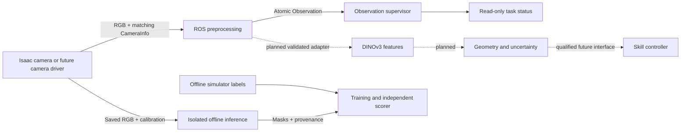

# Interfaces and code ownership

This is the working contract for the mounted Zero 2 W perception path. The current system observes a stationary simulated cell. It does not yet execute pickup or insertion. The independent DINOv3 test is offline; the live ROS model adapter remains disabled.

## Follow one image through the system

The simulator owns scene construction and rendering. Preprocessing owns image geometry. The learned model owns pixel predictions. A future geometry estimator must own metric pose and uncertainty; a future skill controller must own bounded commands and recovery. Pixel classes are not grasp points, contact measurements or motion permission.

## Active ROS channels

The camera prefix is `/cell/cameras/macro`. Topic names and message definitions live in `ros2_ws/src/ffc_cell` and `ros2_ws/src/ffc_interfaces`.

| Channel | Producer → consumer | Payload and acceptance rule |
|---|---|---|
| `image_raw` | Isaac camera → frontend | Native 2448 × 2048 RGB8; complete payload, valid stride, optical frame and acquisition stamp |
| `camera_info` | Camera adapter → frontend | Same stamp/frame and native dimensions; reviewed intrinsics, five distortion coefficients, no hardware crop |
| `observation` | Frontend → supervisor | One message containing 1232 × 1024 RGB, mono8 edges, transformed calibration, source identity and six quality measurements |
| `/cell/diagnostics` | Frontend → observer | Accepted/rejected counts, image quality and explicit rejection or stale reason |
| `/cell/task/status` | Supervisor → observer | Observation health; `motion_permitted` remains false |
| `/tf_static` | Scene camera adapter → ROS | Fixed camera extrinsics for visualization; not yet a locked runtime rig registry |

Camera traffic uses best-effort delivery. The synchronizer keeps four messages and requires exact timestamp matches; processed observations use depth one. Dropping an old frame is preferable to silently consuming a backlog. Local Fast DDS transport settings are in `config/fastdds-camera.xml`; native images need substantially more shared memory than a small default DDS sample.

The current static renderer timestamps acquisition using wall time. All consumers must use the same clock. Historical episode-relative simulation times must not be mixed with this stream. A future simulated controller using `/clock` requires a coordinated clock change across every node, plus reset handling and tests.

The frontend checks freshness both before and after preprocessing. The supervisor independently checks the complete observation and rejects missing, duplicate, out-of-order, stale, changed-calibration or excessively future-dated input. The deadline is 500 ms, with 5 ms future tolerance. The current renderer delivers about 1.2 fps, so stale intervals are expected and remain visible. Increasing the deadline to conceal that limitation would not qualify closed-loop control.

## Camera and model geometry

The canonical definitions are in [`src/ffc/macro_contract.py`](src/ffc/macro_contract.py). The ROS package references that file through a repository symlink; its Docker build includes the canonical target. There is one implementation to review.

- Native image: RGB8, 2448 × 2048, `macro_optical_frame`, profile `macro-mount-elevation45-v1`.
- Frontend: distortion correction, area resize by two, then four black columns on each side. Output is 1232 × 1024. Intrinsics follow the resize's pixel-centre convention and padding.
- Labels: discrete nearest-neighbour sampling with the exact OpenCV tie convention, followed by the same padding. The shared label transform rejects nonzero distortion; adding distorted synthetic labels requires an explicit remapping implementation and tests.
- Model: frozen DINOv3 backbone plus the trained feature head. Class order is background, upper rim, lower rim, cable leading band, open slider, closed slider. Checkpoints must match exact class names/order, input dimensions, profile and preprocessing revision.
- Geometry conventions: calibration matrices are finite; focal lengths are positive; fixed transforms are homogeneous proper rigid transforms. ROS optical axes are right, down and forward. Future metric poses and forces must use metres, radians and newtons, with an explicit frame and acquisition time.

`calibration_id` on the current ROS observation hashes native intrinsics, distortion, dimensions and frame. It does **not** lock the stand position. Offline inference additionally compares the entire frozen camera contract, including `world_optical`, and records its canonical SHA-256 fingerprint. A live estimator still needs a reviewed extrinsic registry and model-to-rig identity check. A configured profile string alone cannot establish that the physical camera is correctly mounted.

Every observation contains matching headers on RGB, edges and CameraInfo. The receiver checks encodings, lengths, dimensions, rectification, projection consistency and quality field ranges. The quality fields are mean/std luma, low/high clipped fractions, Laplacian variance and edge fraction. These are image diagnostics, not calibrated detection confidence.

## Files crossing process boundaries

| Artifact | Owner and contents | Completion / consumption rule |
|---|---|---|
| `sensor/` | Capture: RGB PNGs and `camera.json` | Runtime inference receives only this data subtree, never labels or scene geometry |
| `offline/` | Capture: class masks, manifest, authored poses and source snapshots | Accessible only to validation, supervised training and scoring |
| `validation.json` | Dataset auditor: dimensions, hashes, labels and geometry checks | Required before the training runner; retain the full capture report and any failure record |
| Model directory | Trainer: checkpoint, training report, sensor contract, source archive and `frozen.json` | Freeze after successful training; choose weights using validation only, before independent test capture |
| `predictions.json` + masks | Isolated inference: input hashes, class order, model/backbone hashes, rig fingerprint and timing | Report is written after all frames; a partial directory without the report is incomplete |
| Evaluation JSON | Offline scorer: confusion, visible-object metrics, false positives and review rows | Test split only; input RGB identities must match prediction identities; no threshold fitting here |
| `docs/` evidence | Publisher: curated images, metrics, videos and notebook | Public review copy; never credentials, private machine files or a robot command endpoint |

Training and inference runners require fresh output directories. Failed runs remain as evidence and receive a new directory on retry. Do not overwrite a frozen model to make a later check pass. Inference verifies checkpoint and backbone digests before loading weights and checks the exact frozen camera contract. It runs without network access and without mounting offline labels or USD scenes.

A hash establishes identity, not trust in arbitrary downloaded code or files. These artifacts are produced by our controlled pipeline. Older experiment scripts have less strict schemas; new consumers must not silently treat a historical report as the current format. The capture process can retain `invalid.json` on failure; successful process exit alone is not sufficient evidence of a valid dataset.

## Where code belongs

| Location | Responsibility |
|---|---|
| `src/ffc/macro_contract.py` | Pure NumPy/Python contracts, calibration identity, label geometry and model metadata checks |
| `ros2_ws/src/ffc_cell/ffc_cell/cv_frontend.py` | Reusable OpenCV preprocessing; no ROS message or simulator dependency |
| `ros2_ws/src/ffc_cell/ffc_cell/observation_contract.py` | Complete observation-envelope validation, independently testable without ROS |
| `ros2_ws/src/ffc_cell/ffc_cell/guard.py` | Timestamp ordering, age and calibration continuity |
| ROS node modules | Message synchronization, conversion, publication and supervision |
| `src/ffc/*model.py`, `dinov3_features.py` | Learned model and feature extraction |
| `scripts/` | Run orchestration, capture, train, infer, score and publish entrypoints |
| `config/` | Reviewed, versioned experiment and hardware profiles |
| `experiments/` | Evidence, limits, failure records and reproducible commands |
| `tests/` and ROS `test/` | Geometry, pure contracts, malformed-input and frontend checks |

Keep numerical transforms and validation out of launch scripts. Keep ROS transport out of model code. Keep simulator label generation out of inference imports. Historical physics/controller utilities remain for their recorded experiments; their presence does not authorize reconnecting privileged state to the current robot policy.

## Interfaces still to commission

`FeatureFrame.msg` reserves acquisition-stamped masks, calibration/model identities, class names, uncalibrated scores and processing duration. The live publisher is not commissioned. Before enabling it, test the installed model adapter, post-inference age, dropped frames, invalid metadata and recovery. A good offline score does not establish this integration.

`TactileFrame.msg` reserves a calibrated taxel grid in newtons. Unmeasured shear arrays must be empty; invalid data must be marked invalid. There is no qualified tactile publisher yet. Measured joint state, tool state and wrist wrench adapters also remain future work. Do not synthesize a healthy sensor channel by publishing zeros.

The next geometric output needs an explicit observed entrance/cable frame, covariance or validated error bound, visibility/occlusion state, supporting image identity and a reason for abstention. A future action interface must specify goal frame, limits, timeout, cancel/stop behavior and independently measured completion. It must reject expired estimates. It must not turn a segmentation centroid into a motion goal.

Contact and insertion need qualified cable/contact mechanics and sensor-derived feedback. Latch and electrical seating verification are separate skills. Those gates remain open; current changes improve data integrity and reproducibility, not insertion readiness.
