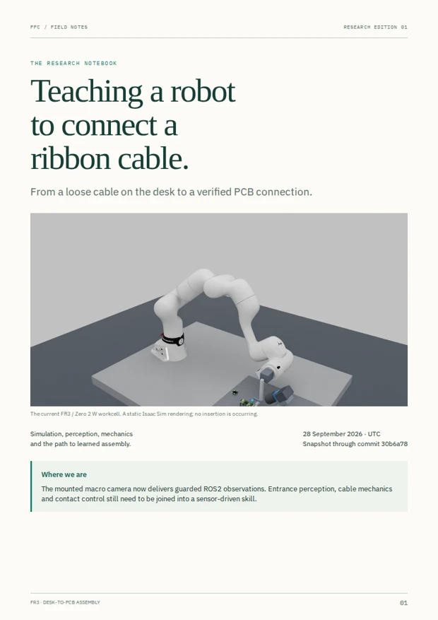
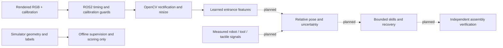

# FR3 ribbon-cable assembly research

[](https://github.com/lakshya-asu/ffc-insertion-research/actions/workflows/checks.yml)
[](https://lakshya-asu.github.io/ffc-insertion-research/notes/ffc-research-notebook.pdf)
[](ISAAC.md)
[](experiments/020-native-camera-ros2.md)
[](experiments/017-entrance-feature-perception.md)
[](SENSOR_FIRST.md)

Starting with a loose ribbon cable on a desk, teach a Franka FR3 to pick it up, inspect and orient its end, insert it into a PCB connector, operate the latch and verify the connection. We are developing the proof of concept in simulation before physical hardware validation.

**[Read the research notebook · PDF](https://lakshya-asu.github.io/ffc-insertion-research/notes/ffc-research-notebook.pdf)** · **[Open the live lab](https://lakshya-asu.github.io/ffc-insertion-research/live/)** · **[Explore the architecture](https://lakshya-asu.github.io/ffc-insertion-research/architecture/)** · **[Start with the project overview](https://lakshya-asu.github.io/ffc-insertion-research/)** · **[Historical experiment videos](https://lakshya-asu.github.io/ffc-insertion-research/experiments.html)**

<a href="https://lakshya-asu.github.io/ffc-insertion-research/notes/ffc-research-notebook.pdf"></a>

## Read the complete notes

The illustrated **23-page research notebook** explains the task, hardware choices, camera optics and mounting, software architecture, ROS2, perception results, cable mechanics, learning roadmap and evaluation plan. It includes a clickable contents page and linked experiment records.

- [Open / download the PDF](https://lakshya-asu.github.io/ffc-insertion-research/notes/ffc-research-notebook.pdf)
- [View the PDF file on GitHub](docs/notes/ffc-research-notebook.pdf)
- [Download directly from GitHub](https://github.com/lakshya-asu/ffc-insertion-research/raw/refs/heads/main/docs/notes/ffc-research-notebook.pdf)
- [Source and rebuild instructions](docs/notes/README.md)

Edition 01 records the project through commit `30b6a78`. Subsequent experiments are linked below. Figures are identified as simulated; historical geometry trials and current camera-based work are kept separate.

<br clear="right">

## Current milestone

**[Seven skills: completed work, remaining work and pass criteria](SEVEN_STEPS.md)** · **[Mounted tool motion](https://lakshya-asu.github.io/ffc-insertion-research/hardware/custom-gripper.html#mounted-motion)**

The active scene is **Raspberry Pi Zero 2 W side-entry cable insertion**, with the earlier offset tool and a **Basler ace 2 / Kowa 35 mm macro camera at 45°**. The Pi 4 Model B + Camera Module 3 scene remains available. A phone-style press-on flex connector is a separate later task.

| Area | Evidence so far | Still required |
|---|---|---|
| Camera and mounting | Dimensioned optical reference; full-tool visibility; sampled arm clearance and tool/cable translation bounds | Manufactured mount, stiffness and complete workcell collision qualification |
| ROS2 | Native 2448 × 2048 RGB, calibration, exact timestamp pairing, OpenCV preprocessing and stale-frame guards | Dynamic timing and control-rate qualification |
| Mounted-camera dataset | 160 scenes: 128 train / 32 validation; independent 30-scene audit and three matched setback pairs | Broader appearance/geometry variation and physical validation |
| Perception | Earlier DINOv3 feature study completed; mounted macro model independently tested on 60 fresh scenes | Verified cable-to-entrance pose, calibrated uncertainty and action readiness |
| Cable/contact mechanics | Numerical benchmarks and historical generic-scene handling tests | Pi cable bending/twist, grip slip, connector resistance and latch mechanics |
| Robot actions | Unloaded FR3 joint tests; new CAD tool mounted in a separate empty-tool physics scene | Sensor-driven pickup, insertion, latching and verification; the Pi perception cell still has motion disabled |

The larger commercial-actuator CAD tool has a separate mounted dynamics study. It does not inherit the earlier tool’s camera, PCB or approach-clearance results.

The matched mounting audit found that a **6 mm grasp setback hid the leading band in all three tested pairs**, while a **10 mm setback exposed it**. That supports a visibility choice, not a claim of grasp stability. [Inspect the RGB, offline labels and video](https://lakshya-asu.github.io/ffc-insertion-research/live/#macro-data).

Read the [assumed-world bending experiment](experiments/037-assumed-world-fit.md) and [next contact qualification steps](research/cables/contact-qualification.md). The [bending review](https://lakshya-asu.github.io/ffc-insertion-research/hardware/custom-gripper.html#bending-fit) includes reference curves, recorded Isaac runs and individual reserved-case views.

The [first flexible-cable motion pilot](https://lakshya-asu.github.io/ffc-insertion-research/hardware/custom-gripper.html#flexible-motion) now closes on a presented cable end, lifts and holds under local pad/encoder feedback. Empty and load-dropout checks are recorded. This remains separate from FR3 motion, camera verification and ROS integration. [Methods and limits](experiments/038-flexible-cable-motion.md).

## Current execution plan and run library

[Maintained learning and simulation plan](research/learning/PLAN.md) · [Rendered runs and native Isaac replays](https://lakshya-asu.github.io/ffc-insertion-research/library/). The library distinguishes recorded-state playback from physics reruns and keeps missing training channels explicit.

## System overview



The ROS camera/frontend and live mounted-model inference paths are implemented. The model has an independent offline test, checked rig/calibration identities and post-inference freshness rejection. Tactile streams, metric pose estimation and robot control are not connected. Simulator object poses, mesh state and offline annotations do not enter a deployed policy, critic, reward or stage transition.

## Start with these experiment records

| Record | What it answers |
|---|---|
| [030 · Mounted tool motion](experiments/030-mounted-tool-motion.md) | Physical tool joints, loaded arm movement, cancellation and model limits |
| [022 · Mounted macro DINOv3](experiments/022-mounted-macro-dinov3.md) | Frozen-model test on 60 fresh scenes, including the misses |
| [021 · Mounted macro dataset](experiments/021-mounted-macro-dataset.md) | What the full tool hides; dataset integrity and matched setback comparison |
| [020 · Native camera over ROS2](experiments/020-native-camera-ros2.md) | Message contracts, timing, transport failures and fault tests |
| [019 · Macro mount](experiments/019-macro-mount.md) | Why 45° replaced 25°; clearance, route and visibility limits |
| [018 · Macro optics](experiments/018-macro-camera.md) | Lens choice, sampling, working distance and optical assumptions |
| [017 · DINOv3 entrance features](experiments/017-entrance-feature-perception.md) | Earlier rim/leading-band scores and unresolved latch errors |
| [015 · Reliability pass](experiments/015-zero-reliability.md) | Why better masks still led to an always-abstain policy |
| [013 · Zero CAD](experiments/013-pi-zero-side-entry.md) | PCB/cable provenance and unmeasured dimensions |
| [005–007 · Mechanics](experiments/007-contact-and-transport.md) | Solver checks, handoff failures and historical transport evidence |

[Task contract](task-specification.md) · [Observation boundary](SENSOR_FIRST.md) · [Calibration assumptions](CALIBRATION.md) · [All experiments](experiments/)

## Run and reproduce

### CPU checks

```bash
uv sync --locked
uv run python scripts/fetch_fr3.py  # pinned public assets for geometry tests
uv run pytest -q
uv run ruff check src tests
```

GitHub Actions runs the CPU suite on Python 3.14. Its badge does not certify GPU rendering, ROS integration, physical mechanics or robot safety. ROS frontend tests live separately in `ros2_ws/src/ffc_cell/test/`.

### Native ROS camera setup

On a machine with the existing scene assets and Isaac image:

```bash
docker build -f Dockerfile.ros2 -t ffc-ros2:jazzy-dinov3 .
docker compose -f compose.yaml -f compose.ros2.yaml up -d perception
docker compose -f compose.yaml -f compose.ros2.yaml run --rm experiment
```

The tested GPU is an RTX 5080 with 16 GB VRAM. Docker, NVIDIA Container Toolkit, compatible drivers and locally prepared CAD/model assets are required. See [Isaac setup](ISAAC.md), [CAD import](experiments/013-pi-zero-side-entry.md) and [ROS reproduction](experiments/020-native-camera-ros2.md). This is not a one-command fresh-clone installation: large CAD assets, model weights and generated scenes are excluded from git.

Follow [LAB_LIVE.md](LAB_LIVE.md) before starting capture; stop the existing preview so two renderers do not compete. Use a **fresh output directory for every experiment**. Preserve failures and source/configuration hashes. Gated model weights require the user's own approved access and remain local; credentials are never committed.

## Historical handling results

The generic segmented-cable scene completed one direct desk-to-open-slot sequence and one passive-fixture sequence under its selected numerical profile. Both reached approximately 3.801 mm geometric depth. The direct trial took 41.760 simulated seconds; the fixture trial took 66.789 seconds.

Those experiments used **privileged simulator state for alignment** and an assumed clearance slot with zero cable/connector contact. They do not establish camera-driven Raspberry Pi insertion, electrical function, latch closure or hardware reliability. Their failures and numerical audits remain useful evidence.

[Historical direct video](https://lakshya-asu.github.io/ffc-insertion-research/outputs/e040-direct-pgs/experiment.mp4) · [Mechanics record](experiments/007-contact-and-transport.md) · [Morning report](MORNING_REPORT.md)

## Next gates

- [x] Import and audit Pi workpieces; isolate offline supervision from runtime inputs.
- [x] Resolve macro placement with the full tool; publish the rejected view too.
- [x] Connect native RGB/calibration through ROS2 and test observation faults.
- [x] Audit the mounted-camera dataset and actual frontend compatibility.
- [x] Freeze and independently evaluate a mounted-camera perception model.
- [x] Connect rig-bound live ROS inference, test expiry/fault handling and record a presentation demo.
- [ ] Estimate a usable cable-to-mouth frame with uncertainty.
- [ ] Qualify cable/contact mechanics and realistic force/tactile observations.
- [ ] Demonstrate bounded pre-grasped alignment, insertion and recovery.
- [ ] Compare pickup routes, add latch manipulation and verify the full assembly.
- [ ] Run controlled imitation/RL comparisons, followed by physical transfer.

Read [Interfaces and code ownership](IO_CONTRACTS.md) for the active ROS channels, camera/model contracts, artifact boundaries and remaining integration gates.

[Open the presentation demo](https://lakshya-asu.github.io/ffc-insertion-research/demo/) · [Presenter runbook](DEMO.md) · [Live inference evidence](experiments/024-live-inference-demo.md)

Latest diagnostic: [image-space edge fitting and abstention](experiments/025-image-alignment.md), with [all 60 views](https://lakshya-asu.github.io/ffc-insertion-research/demo/#alignment). This is not yet a metric pose estimator.

Latest executed motion: [Isaac joint probes and cancellation](experiments/027-isaac-joint-motion.md), with [actual videos and joint traces](https://lakshya-asu.github.io/ffc-insertion-research/demo/#motion). This commissions unloaded joint tracking; vision-driven insertion is not connected.

## Repository map

Latest cable work: [source dossier and learning sequence](research/cables/standard-mini-200.md),
[thin-body numerical checks](experiments/036-cable-evidence-and-thin-bending.md), and
[videos and comparison](https://lakshya-asu.github.io/ffc-insertion-research/hardware/custom-gripper.html#cable-physics).
The bending checks fail; pickup-policy dataset release remains closed.

| Path | Contents |
|---|---|
| `src/ffc/` | Geometry, kinematics, simulation, perception and audit utilities |
| `scripts/` | Capture, training, isolated inference, scoring and publishing |
| `config/` | Versioned task, optical, dataset and numerical protocols |
| `ros2_ws/src/` | Camera frontend, supervision and sensor message contracts |
| `experiments/` | Hypotheses, outcomes, failures and reproduction notes |
| `docs/` | GitHub Pages site, curated evidence, video reviews and PDF |
| `outputs/`, `third_party/` | Local generated runs and external assets; ignored by git |

## Attribution and contribution

Scene assets and model weights retain their original licenses and access terms. Zero PCB-derived review images retain the [Optocam Zero CC BY-SA 4.0 attribution](docs/live/macro-data/ATTRIBUTION.txt); FR3 geometry comes from the official Franka simulation assets. There is no blanket license claim covering all repository content. See per-asset attribution and the notebook's final page.

For changes, include the experiment scope, source/configuration revisions, relevant tests and retained failure evidence. Keep static renders, software checks, simulated mechanics and physical validation distinct. [Contribution notes](CONTRIBUTING.md).
