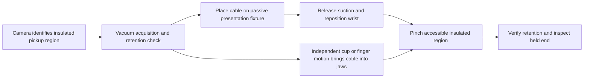

# Tool options remain open

Updated 2026-09-28. No purchasing decision or hardware release. Retain previous CAD, reports and videos; a candidate's relative priority does not retire it.

| Option | Current evidence | Open question |
| --- | --- | --- |
| PGEA-2-10 with custom fingers and miniature vacuum pickup | Supplier CAD, finger/mount geometry review, idealized rigid-sample pinch bench | Minimum achievable fingertip force, vacuum handoff, full cable dynamics |
| Earlier two-PQ12 hybrid mechanism | CAD, prescribed mechanism reviews and separate mounted motion experiment | Size, compliance/load path, pickup and connector access |
| Zimmer Multi-Item Gripper | Manufacturer shows combined suction and parallel fingers | Exact order code, dimensions, minimum force, standalone availability, cable handoff |
| RightHand Robotics combined suction/finger tool | Manufacturer describes suction acquisition followed by finger stabilization | Standalone availability and suitability for narrow cable insertion |
| SCHUNK parallel gripper with added vacuum | Commercial gripper specifications reviewed | Force range and bulk versus delicate cable requirements |
| Other commercial pinch/vacuum devices from earlier hardware review | Retained in existing hardware pages and sourcing notes | Compare exact variants when sufficient CAD and force specifications exist |

The Schmalz miniature cup is a component candidate, not a complete gripper. It does not commit us to any pinch actuator. The same footprint, clearance, sensing, force and cable-deformation checks apply to every option.

The [side-entry comparison](../../experiments/035-handoff-geometry-and-settling.md) now includes a fixture CAD concept and an integrated cup-travel envelope. Gravity tests revealed numerical sensitivity in the segmented ribbon, so neither branch has passed flexible-cable handoff qualification.

## Two handoff branches

For integrated handoff, check the entire motion of the lower finger relative to the desk and cable, not just the final pad placement. A fixed cup and fixed jaws on the same wrist cannot change their relative position by moving the wrist. A movable pickup/finger mechanism, deliberate cable deformation or an external support is needed; none has yet passed this task's handoff gate.

For the fixture branch, check cable placement and release, repeatable presentation, a relieved opening below the pinch patch, tail clearance, and the robot's re-approach. A fixture may simplify the wrist but introduces another observation and placement step.

## Information from the user

Nothing is required to continue the simulation geometry and physics studies. We keep uncertain dimensions explicit and run sensitivity studies. Later, an exact cable/connector part or specimen measurements will replace those assumptions before a purchase decision. Physical hardware testing remains deferred.

See [market research and primary sources](suction-pinch-market-review.md) and [the grasp footprint experiment](../../experiments/034-grasp-footprints.md).

## Compact voice-coil candidate

The [micro-flexure design](../micro-flexure/README.md) replaces the two-PQ12 mechanism with a bare H2W NCC01-04-001-1X actuator, steel flexure guidance, a sensing upper finger and a fixed offset suction tip. Complete nominal head: 30 × 28 × 24.7 mm, excluding adapter and leads. It uses the passive-fixture handoff branch. CAD and preliminary analytical screening are available; manufacturing details and physics remain unqualified. All earlier options remain available.
