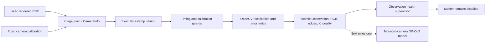

# Native macro camera over ROS 2

The mounted 45-degree Basler/Kowa simulation now publishes native 2448 × 2048 RGB, matching CameraInfo and fixed world-to-optical calibration into ROS 2 Jazzy. The separate perception container receives no USD scene, object poses or offline labels. This is a stationary rendered sensor test, not insertion control.

## Working path



Native images use RGB8 and the optical frame `macro_optical_frame`. Source image and calibration must have identical timestamps. The current static renderer stamps wall-clock acquisition after rendering; `use_sim_time` is false. Dynamic physics experiments will need a consistent simulation clock and acquisition-time contract before control.

The OpenCV frontend rectifies calibrated distortion, area-resizes the complete image by one half and pads four pixels on each side, producing 1232 × 1024. Intrinsics follow the same pixel-center transform. Canny edges and brightness/sharpness diagnostics accompany RGB; the learned model will receive RGB, with additional channels requiring separate evaluation. No automatic sharpening or contrast enhancement is enabled. Simulation distortion is zero, not a measured lens calibration.

`Observation` carries the source header, RGB, edges, transformed CameraInfo, intrinsic calibration hash, preprocessing revision and configured source profile. The hash does not yet cover extrinsics. A changed camera mount requires an explicitly reviewed calibration profile. `FeatureFrame` and `TactileFrame` are contracts only; there is no active learned macro inference or tactile publisher. No actuator endpoint is connected.

## Transport and evidence

A native image is 15,040,512 bytes. Default transport initially discovered peers but failed to deliver these images. The explicit Fast DDS profile reserves a 128 MiB shared-memory segment and a 16 MiB maximum message. Containers share host IPC and use localhost discovery. Raw subscriber queues retain four samples for timestamp pairing; the synchronized observation output retains only the latest sample. A depth-one input queue lost pairs in this configuration.

The final live check, `outputs/ros2-live-003`, received 35 consecutive processed observations over approximately 30 seconds, at roughly 1.19 fps. Publication-to-observer ages were 22.5–44.9 ms. The observer also received 34 raw images and 34 CameraInfo messages; their observation correspondence can be checked by timestamp, with subscription startup accounting for the different totals. This is a small single-host test, not sustained throughput certification.

The renderer is slower than the 500 ms freshness deadline. The supervisor correctly alternates between fresh observation and stale status between frames. We have not widened that deadline to disguise the rendering rate. Motion remains false in both states.

The isolated DDS fault suite checks valid RGB, stale acquisition, wrong optical frame, changed calibration, mismatched timestamps, blank images, camera dropout and fresh recovery. The Python unit suite also tests pixel-center calibration, invalid input and timestamp ordering. Failed runs remain available: 001–002 exposed transport failure, 003 exposed a test-fixture timestamp alias, and 005 omitted its input-image mount. Successful final fault evidence is run 006.

## Run

```bash
docker build -f Dockerfile.ros2 -t ffc-ros2:jazzy-dinov3 .
docker compose -f compose.yaml -f compose.ros2.yaml up -d perception
docker compose -f compose.yaml -f compose.ros2.yaml run --rm experiment
```

Do not start a second renderer while the live preview is running. Use the stop-preview protocol in LAB_LIVE.md first.

## Next acceptance gate

Capture a new development set using this mounted camera and full tool, train with exactly this preprocessing revision, freeze the selected checkpoint, then capture and score an independent test set. Label upper/lower entrance rims, cable leading edge and latch separately. Include occlusion, glare, focus drift and absent features. Report boundary error and false detections as well as mask overlap. Runtime inference must run with RGB/calibration access only. A mask alone does not establish a verified insertion pose.

Sources: [Isaac ROS installation](https://docs.isaacsim.omniverse.nvidia.com/latest/installation/install_ros.html), [Fast DDS transport configuration](https://fast-dds.docs.eprosima.com/en/2.6.x/fastdds/xml_configuration/transports.html), [CameraInfo contract](https://raw.githubusercontent.com/ros2/common_interfaces/jazzy/sensor_msgs/msg/CameraInfo.msg).
