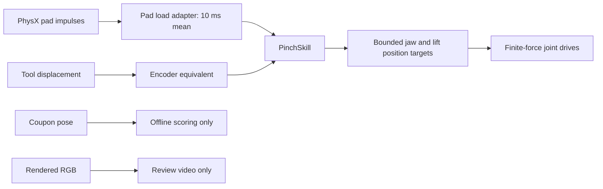

# 033 — Deterministic pinch with simulated feedback

The requested desk-to-PCB, sensor-driven task is **not complete**. This experiment
builds its first compact-tool contact primitive: close on a supported rigid
terminal sample, qualify bilateral pad load, lift 10 mm and hold. The controller
receives tool encoder equivalents and two pad-load readings. Camera/DINO
inference and ROS transport are not connected to this bench.

The uniform sample has no explicit exposed-contact/stiffener regions. It does
not establish a safe grasp location on a real cable. Experiment 034 separately
checks those planar regions and rejects the proposed near-tip stiffener grip
under the current dimensional assumptions.

## Results

| Case | Result |
|---|---|
| Supported sample, final controller | Contact hold completes at 7.4135 s; tool lift 9.992 mm; offline sample lift about 9.972 mm |
| Empty | `empty_or_too_thin`; commanded lift stays zero |
| Injected pad-load dropout during lift | `contact_lost`; lift reference freezes at 2 mm; measured additional lift about 0.0025 mm over the following 0.25 s |
| Initial, unstable support placement | Sample tips away; no bilateral contact; controller does not lift |

Final positive pad readings are approximately 0.119 and 0.117 N. These are
idealized aggregate contact-load signals, not calibrated tactile measurements.
The PGEA catalogue's force range is not an identified motor model: our 0.8 N
drive cap and position servo do **not** prove that its real controller can
reproduce this low-force behavior. Controller interfaces, attainable force and
timing must be qualified before calling this a selected-hardware proof.

## Observation/action boundary



`src/ffc/pinch_skill.py` has no USD, physics, object-pose or renderer dependency.
It accepts timestamped tool travel, lift and two scalar pad loads. The sensor
adapter selects contacts at its known pad surfaces, discards counterpart
identity, and sums contact impulse magnitudes divided by the physics timestep.
This is not a normal/shear tactile array and must not be published as one.

Closing advances at 1 mm/s per jaw. Both pad readings must exceed 0.08 N for
50 ms before a 5 mm/s lift begins. An almost-closed measured gap rejects an
empty grasp, even if empty pads were to load each other. Stale/nonfinite
feedback, overload, encoder-range faults and contact loss latch a stop with
frozen references. These thresholds are **bench settings**, not damage limits.

The controller reports `contact_hold_complete`, not `grasp_success`. Camera
evidence of retention and a calibrated load path are still required for the
task-level skill. The offline coupon pose never governs a transition or target.

## Mechanics and fidelity

- Isaac rigid-body contact, PGS, 0.5 ms timestep, 255 position iterations.
- Rigid 30 × 11.5 × 0.3 mm coupon, assumed mass 0.2 g, on a presentation support.
  This is not the full 200 mm flexible cable.
- Physical prismatic joints for both jaws and a bench lift axis. No robot arm
  or vacuum mechanism participates in this test.
- Jaw drive assumptions: 10,000 N/m stiffness, 2 N·s/m damping, 0.8 N force cap.
- Only the tool's pad boxes collide. The supplier/finger CAD is visual; full
  tool collision, pad compliance and material calibration are not qualified.
- Assumed pad static/dynamic friction: 0.5/0.4. No friction or stiffness sweep is
  claimed. Sensors are noise-free; controller updates run at the physics rate,
  which is not a verified PGEA/RS485 update rate.
- The sample moves through contact. There is no fixed-joint grasp, sample
  teleportation, pose-following constraint or scripted sample movement.

## Evidence

`outputs/pinch-bench-001` retains the failed support-placement run. Run 002 is
the successful pilot. Runs 003 (empty), 004 (load dropout) and 005 (positive
repeat) use the final controller, including the empty-gap rejection. Their
runner and controller sources are copied into each run directory. Reports,
sensor traces, offline sample traces and videos are retained separately.

The six unit tests cover missing contact, unilateral contact, empty-pad load,
contact loss, stale/nonfinite/overload feedback, and the deliberately limited
completion meaning. Existing motion-proposal and trajectory tests also pass.

```bash
docker compose run --rm experiment scripts/isaac_pinch_bench.py \
  --case coupon --output /workspace/outputs/pinch-bench-NEW
```

Other cases are `empty` and `load_dropout`. Choose a fresh directory, and pause
other Isaac renderers first. The public evidence is assembled by
`scripts/publish_pinch_bench.py` from the recorded run IDs; it includes the
initial failure rather than dropping it from the record.

## What still separates this from the requested demonstration

1. A physically modeled full cable and qualified pad/nozzle contact. The fixed
   vacuum pickup hardware and pressure/flow model do not exist yet.
2. Dynamic compact-tool mounting on the FR3 with bounded actuator behavior and
   clearance checks. The mounted candidate remains a static visual assembly.
3. Calibrated, synchronized ROS tool feedback alongside the existing camera
   stream. This local bench controller does not validate ROS timing or faults.
4. New-tool visual observability and metric alignment, followed by a bounded
   camera-driven approach. The existing DINO model and dry-run proposals are not
   an executable insertion controller.
5. Pi connector/cable contact, bounded insertion and independent seating
   evidence. None is demonstrated by a successful rigid-sample lift.

These are implementation gates for the simulation proof of concept. Real
hardware testing remains deferred, as requested.
