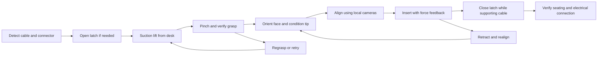

**Robot and actuator selection for desk-to-PCB FFC assembly**

Research date: 26 September 2026. Status: evidence-backed concept selection; mechanical dimensions and force settings require representative parts and bench measurements.

**Current user decisions:** use Franka FR3 as the design platform; connector type remains undecided. The user subsequently set aside the earlier under-US$20,000 budget constraint to begin engineering development. The alternatives and cost estimates below are retained as research context, not current selection constraints. No procurement has been authorized or performed.

**Recommendation.** Use one Franka Research 3 with FCI and a custom gripper combining retractable suction pickup, narrow parallel jaws, measured grip force, and provision for cable feed. Select the ROBOTIS XC330-M288-T as the initial small-gripper actuator, subject to a linkage load calculation and bench validation. Use xArm 7 as the budget alternative. Instrument the fixed connector fixture for insertion forces before committing to a sensitive sensor beneath the entire moving tool.

The robot recommendation assumes that the primary purpose is research into perception, learning, compliance, and recovery. If the objective becomes a fixed production process with a strict cycle time, the industrial-arm comparison should carry more weight. No supplier quotations were obtained, and no purchases or supplier contacts were made.

**Task and working assumptions.** The user requires a cable lying on a desk to be picked up correctly and connected into a PCB. Pre-grasped insertion is a subsystem test, not the project deliverable. For concept development, assume a single separated cable with both ends initially free, a rigidly mounted PCB, known cable/connector geometry, and controlled lighting. Randomize cable position, in-plane orientation, face orientation, and moderate curvature. Overlapping piles, an already-attached opposite end, and an unfixtured PCB require additional design work.

Until the connector is chosen, include latch opening and closure in the architecture. Early insertion experiments may start with the latch open, but a ZIF connection must be secured before reporting complete assembly. A one-action connector is a separate option if PCB design is under our control.

The proposed sequence is:

**What the closest research actually establishes.**

| Evidence | Finding relevant to hardware | Scope limitation |
|---|---|---|
| Buzzatto et al., IROS 2022 | Combines suction pickup, active nails, rolling fingertips, and parallel jaws; specifically addresses cables on flat surfaces. The implementation uses an XM-430 for jaw aperture, Pololu micro motors for local mechanisms, and a Mitsubishi RV-4FRL arm. | A useful mechanical precedent, not a ready-to-buy validated gripper for our cable. |
| Liang et al., OJIES 2024 | The authors report 399/400 insertion attempts and 200/200 connector releasing/securing trials using multiview pose estimation and a multimodal gripper. | Figures were checked against the author project summary; the complete experimental protocol was not retrieved. Do not interpret them as our expected desk-to-connection rate. |
| Ling et al., 2025 | Uses tactile information and memory to correct insertion; the paper explicitly excludes grasping and initial visual alignment from its scope. | Its “100%” completed-insertion result does not establish full-task success. |
| RL for Robotic Insertion of Flexible Cables, 2025 | Uses two views and reports real transfer across cable variants. | Its geometric success definition places cable-tip corners within 1 mm of the connection area; this is not an electrical verification criterion. |

Sources: [2022 author-uploaded paper](https://www.researchgate.net/publication/364731339_On_Robotic_Manipulation_of_Flexible_Flat_Cables_Employing_a_Multi-Modal_Gripper_with_Dexterous_Tips_Active_Nails_and_a_Reconfigurable_Suction_Cup_Module), [2024 author project summary](https://joaobuzzatto.com/cable-assembly/), [Ling full paper](https://arxiv.org/pdf/2502.12514), [2025 RL paper](https://arxiv.org/html/2509.13731v1). These support design directions, not a claim that any proposed stack is already validated.

**Robot comparison.** Published repeatability measures repeated positioning under specified conditions; it does not guarantee absolute cable-tip accuracy after camera calibration, deformation, slip, and contact. Control-interface rate also does not equal achievable closed-loop force bandwidth.

| Arm | Verified characteristics | Assessment for this task |
|---|---|---|
| Franka Research 3 | 7 axes, 3 kg payload, 855 mm reach, published repeatability below ±0.1 mm, joint torque sensors. | Preferred research platform. Its redundant joint offers posture choices around cameras and the desk. |
| UFACTORY xArm 7 | 7 axes, 3.5 kg payload, 700 mm reach, ±0.1 mm repeatability. | Cost-oriented alternative; validate small-motion tracking and contact response with the actual tool. |
| Universal Robots UR3e | 6 axes, 3 kg payload, 500 mm reach, ±0.03 mm repeatability, 500 Hz system update; built-in force accuracy specified as 3.5 N. | Strong compact-cell candidate when deployment integration matters. Budget separate sensing for delicate contact. |
| Kinova Gen3, 7-axis configuration | Vendor lists 902 mm reach for the 7-axis variant, 2 kg full-range continuous payload and 4 kg mid-range continuous payload. | Credible research alternative when portability or an existing Kinova ecosystem matters. Do not assume 4 kg throughout the workspace. |
| Mitsubishi RV-2FR | 6 axes, 504 mm reach, 2 kg rated/3 kg maximum load, ±0.02 mm repeatability. | Industrial shortlist for a fixed workcell. Controller integration and tool load limits need explicit review. |

Primary specifications: [FR3 arm](https://franka.de/franka-research-3-arm), [xArm 7](https://www.ufactory.us/product/ufactory-xarm-7), [UR3e manual](https://www.universal-robots.com/manuals/EN/HTML/SW5_19/Content/prod-usr-man/complianceUR3e/H_g5_sections/appendix_g5/tech_spec_data.htm), [Gen3](https://www.kinovarobotics.com/product/gen3-robots), [Mitsubishi catalog](https://dl.mitsubishielectric.com/dl/fa/document/catalog/robot/l%28na%29-09091eng/l09091n.pdf).

The decisive FR3 feature is FCI: vendor documentation exposes joint torque and joint/Cartesian motion interfaces with 1 kHz state access and control. That supports custom compliant controllers and bounded learned corrections. Specify FCI explicitly in the quotation, together with the controller and real-time host requirements. [Franka interface description](https://franka.de/franka-research-3).

xArm's documented servo interface communicates at up to 250 Hz, with 50–200 Hz recommended. Its commands require a smooth externally generated trajectory; some speed/acceleration arguments are not operative in this mode. This is a different interface from direct joint-torque research control. Do not assume that adding an external sensor automatically provides a high-bandwidth compliant controller. [UFACTORY servo guide](https://docs.supportarticle.ufactory.cc/support_articles/developer/ufactory-servo-mode-guide.html).

Kinova provides a 1 kHz low-level actuator path, but its documentation says high-level Cartesian and trajectory functions are unavailable in that mode. It is a viable alternative with additional controller implementation work. [Kortex servo modes](https://docs.kinovarobotics.com/Kinova-kortex2_Gen3_G3L/linked_md/cpp_servoing_modes.html).

My ranking is a task-specific engineering judgment, not a measured robot benchmark: FR3 first for research; xArm 7 for cost; UR3e for a compact industrially integrated cell; Gen3 for portability/ecosystem; Mitsubishi for production-oriented development. A second arm is not initially justified while the board is fixed. A 4-axis SCARA would require extra tooling for arbitrary cable face and tilt correction.

**Gripper architecture and pickup mechanics.**

The proposed first tool has a suction cup on a short retracting slide beside a pair of narrow jaws. It approaches a visible insulated patch near an end, seals, and lifts enough cable for the lower jaw to pass underneath. The cup remains engaged during jaw closure. Release vacuum only after vision and grip sensing confirm a stable pinch; then retract the cup clear of the connector and camera views.

This handoff must be represented in CAD. Simply bolting suction and jaws next to each other does not guarantee that the cable enters the jaws. The slide stroke, cup location, jaw opening, underside clearance, and cable bend radius must be compatible throughout the motion. Use a transparent bench fixture to observe the handoff before installing the tool on an arm.

Schmalz offers miniature flat and oval suction cups, including electronics-oriented materials. Start cup trials around 2–4 mm nominal size where cable width permits; this is a proposed test range, not a selected supplier part. Include a pressure sensor, controllable vacuum release, and a regulated source. [Schmalz electronics suction cups](https://www.schmalz.com/en-us/vacuum-technology-for-automation/vacuum-components/vacuum-suction-cups/suction-cups-for-the-electronics-industry/).

An illustrative suction calculation is F = pressure difference × sealed area. A fully sealed 3 mm circular area at 30 kPa differential gives approximately 0.212 N. This is an ideal static estimate; leakage, cup geometry, surface curvature, desk adhesion, and peeling change actual pickup performance. Test real samples rather than selecting from cable weight alone.

| Gripper option | Benefit | Decision |
|---|---|---|
| Stock parallel gripper with custom fingers | Fastest route to pre-grasped insertion tests | Does not by itself solve flush-to-desk pickup. |
| Suction only | Simple surface pickup | Requires validation of twist resistance, tip support, release, and insertion stability; not the default full-task tool. |
| Retractable suction plus narrow pinch jaws | Separates surface acquisition from stable insertion grasp | Recommended first prototype. |
| Suction plus rolling/feed jaws | Adjusts protruding cable length without a complete regrasp | Reserve space and interfaces; add when measured regrasp failures justify complexity. |
| Active nail or scoop | Alternative where vacuum cannot seal | Evaluate on representative surfaces; keep edges rounded and monitor contact. |
| Dexterous multi-finger hand | Broad manipulation capability | Additional bulk and control variables without a demonstrated need here. |

For latch closure, the cable should remain supported while a small dedicated pusher follows the latch's specified motion. A fixed tab moved by the arm is acceptable only if that motion does not drag the held cable out. Otherwise add an independently actuated pusher. Opening can usually be attempted before cable pickup, simplifying the sequence. Exact latch geometry remains connector-dependent.

**Actuator selection and sizing.**

For the first compact jaw prototype, select XC330-M288-T with a guided symmetric linkage, compliant pads, and an independent grip-force measurement. Its vendor documentation specifies 23 g mass, a 12-bit encoder, 5 V recommended supply, current/current-based-position operation, and 0.93 N·m stall torque at 5 V. Stall torque is not a continuous operating rating. Its supply-current measurement is not a calibrated jaw-force measurement. [ROBOTIS manual](https://emanual.robotis.com/docs/en/dxl/x/xc330-m288/).

The linkage must establish the useful force range mechanically. For a simplified symmetric rack-and-pinion closure, where each jaw has normal load N and pinion radius r, required output torque is approximately 2Nr/efficiency. With illustrative values N = 1 N, r = 5 mm, efficiency = 0.5, the estimate is 0.02 N·m. These assumptions demonstrate the sizing method; they do not establish a safe cable clamp setting or prove that friction and backlash are acceptable.

The friction requirement is approximately 2μN ≥ S × F_axial, where μ is the pad/cable coefficient, S a selected margin, and F_axial the measured insertion and disturbance load. Clamp pressure and local bending then constrain pad area and material. Measure both slip onset and visible/electrical damage across repeated cycles. The actuator must satisfy continuous duty and low-force controllability, not merely maximum torque.

| Function | Initial choice | Upgrade or qualification trigger |
|---|---|---|
| Jaw closure | One XC330-M288-T, guided mechanism, compliant force-sensing jaw | Upgrade if startup friction, force repeatability, or thermal behavior fails bench criteria. |
| Suction deployment | Short spring-return slide with miniature motor/cam or pneumatic drive | Exact drive selected from required stroke and available air supply. |
| Vacuum switching | Solenoid valve, regulated vacuum source, pressure feedback | Choose flow and release behavior from seal tests. |
| Optional feed roller | Prototype with a separately driven roller and spring-loaded idler | Measure cable travel optically; motor position alone cannot detect slip. |
| Optional latch pusher | Small guided servo-driven mechanism | Size after latch trajectory and force measurements. |

A geared smart servo is attractive because its controller and encoder are integrated. If low-force motion proves inadequate, compare an encoder-equipped DC/BLDC drive with a lower-friction transmission, or a short-stroke voice-coil/flexure mechanism with load-cell feedback. These require more drive electronics and integration; they are contingency architectures, not fully sized substitutions.

The original document's Maxon ECX SPEED 13 suggestion should not be treated as a complete precision actuator selection. For example, one 13L configuration lists approximately 61,200 rpm nominal speed and 7.56 mN·m continuous torque. It would need a specific transmission, encoder, controller, and low-speed assessment. A premium motor name does not resolve backlash or force control. [Maxon configuration](https://www.maxongroup.com/maxon/view/product/motor/Konfigurierbare-Motoren/Buerstenlose-DC-Motoren/ECX13-SPEED/ECXZ13L3KN48K1SC1D526B?download=show).

**Force sensing: change the original mounting recommendation.**

ATI Nano17 is a candidate for a lightweight local sensing assembly. Its SI-12-0.12 calibration has 12 N lateral/17 N axial measurement ranges, 0.12 N·m torque ranges, and nominal force resolution of 1/320 N. Those are calibration-dependent range/resolution figures, not accuracy guarantees. [ATI Nano17](https://www.ati-ia.com/products/ft/ft_models.aspx?id=Nano17).

Illustrative load check: a 0.4 kg tool with its center of mass 80 mm horizontally from the sensor produces about 0.314 N·m of gravity moment. That exceeds the cited 0.12 N·m measurement range before insertion. Digital taring cannot remove physical load or restore measurement range. Tool orientation, acceleration, tubing, and simultaneous loading also matter.

My preferred first instrumented rig places a small replaceable connector board on a force-sensing fixture, with its load path through the sensor. Minimize fixture mass and lever arm, strain-relieve test wires, and check sensor deflection. Do not support the board through an additional rigid path that bypasses the sensor. This gives an insertion measurement without carrying the gripper mass; it does not measure cable pickup or all arm contacts.

If wrist sensing is necessary, evaluate Nano25 or Mini45 using the completed tool mass/inertia model. Nano25 SI-125-3 offers 3 N·m torque range and nominal force resolution of about 0.021 N laterally/0.063 N axially; Mini45 SI-145-5 offers 5 N·m and approximately 0.063 N. Neither is automatically sensitive enough for the selected connector. [ATI Nano25](https://www.ati-ia.com/products/ft/ft_models.aspx?id=Nano25), [ATI Mini45](https://www.ati-ia.com/products/ft/ft_models.aspx?id=Mini45).

The accessible UFACTORY sensor V2.0 manual lists 0.10/0.15 N force resolution and 445 g mass. Treat these as version-specific figures and confirm the supplied hardware revision. A compatible accessory is not necessarily the best metrology sensor. [UFACTORY manual](https://www.ufactory.cc/wp-content/uploads/2023/05/6-Axis-Force-Torque-Sensor-V2.0.04.pdf).

AnySkin is worth evaluating later for slip and local contact state; its project demonstrates replaceable magnetic tactile sensing and cross-instance transfer. It is not established here as an FFC-specific solution. Test motor/magnet interference over all gripper states before interpreting its signals as cable contact. Begin with measured jaw force and local vision if space is limited. [AnySkin project](https://any-skin.github.io/).

**Vision and connector choice.**

Use an overhead camera for cable discovery and two local views near the connector: one showing lateral position/yaw and one showing height/pitch. Place the local cameras on the fixture where possible to reduce tool mass. The second view can initially be a measurement camera while the first controls alignment.

A concrete fine-camera candidate is Basler a2A1920-160umBAS: its current documentation lists a global shutter, 1920 × 1200 default image, USB 3, and hardware triggering. Match macro optics, working distance, depth of field, lighting, and clearance to the connector drawing. [Basler documentation](https://docs.baslerweb.com/a2a1920-160umbas).

A 20 mm horizontal field over 1920 pixels yields about 10.4 micrometers per pixel by arithmetic. That is sampling scale, not measurement accuracy. Verify actual edge error using reference targets and cable samples. A camera chosen solely by megapixels or nominal depth resolution can still fail at the gripper's final pose.

For a standard research connector, shortlist Hirose FH12-15S-0.5SH(55): 15 contacts, 0.5 mm pitch, horizontal entry, bottom contacts, and specified 0.3 mm cable thickness. Vendor drawings and STEP data are available. Its published mating/unmating life is 20 cycles, so plan replaceable connector coupons and track cycle count rather than collecting hundreds of trials on one connector. [Hirose product](https://www.hirose.com/product/p/CL0586-0523-6-55).

This is a geometry reference, not a finalized cable/connector BOM. The mating cable must match contact side, conductor count, pitch, width, thickness including the insertion-end construction, exposed contact length, and stiffener details. Pitch is not insertion clearance. Derive tolerances from the drawing and verify with samples.

If we can change the PCB, compare Hirose One Action FH connectors, designed to complete connection without separate actuator handling. This changes the task and could simplify production. Keep the ZIF benchmark if existing electronics assembly is the target. [Hirose One Action](https://info.hirose.com/products/one-action).

Electrical success needs accessible test points and a designed return path. Options include contacting the far end with a test fixture after insertion or using a purpose-built loopback test cable whose effect on mechanics is documented. A loose cable with an inaccessible far end does not become continuity-testable by software alone. Test all intended circuits and relevant shorts; record mechanical seating and latch state separately. Continuity alone can pass a partially seated connection.

**Budget and procurement treatment.**

The xArm 7 US listing showed US$11,000 for a displayed controller bundle and an out-of-stock indication at research time. Treat that as a regional listing, not a delivered quotation. I did not verify public arm prices for FR3, UR3e, Gen3, or Mitsubishi. [xArm listing](https://www.ufactory.us/product/ufactory-xarm-7).

The following are our provisional planning allowances, not researched supplier quotes. They make the likely non-arm costs explicit and must be replaced during BOM preparation.

| Non-arm category | Planning allowance, USD |
|---|---:|
| Custom gripper prototypes, small drives, vacuum and electronics | 1,500–4,000 |
| Fine/global cameras, lenses, illumination and mounting | 2,000–5,000 |
| Calibrated force measurement including acquisition/interface | 3,000–7,000 |
| Fixtures, replaceable connector boards, samples and test electronics | 1,000–3,000 |
| Control computer, networking, power and integration materials | 1,000–3,000 |
| Subtotal | 8,500–22,000 |
| With 25% planning contingency | Approximately 10,600–27,500 |

These exclude engineering labor, tax/import/shipping, facility modifications, and a substantial GPU training workstation. They also assume one principal calibrated insertion-force measurement path; multiple premium sensors raise the budget. Under these assumptions, the xArm route is roughly US$21,600–38,500 before excluded costs. FR3 and other tiers are the supplier's arm/controller/interface quote plus the same non-arm allowance, adjusted for integration.

A project below US$20,000 may need shared/used equipment, simpler measurement hardware, or a smaller initial rig. Reducing expenditure on the arm should not eliminate the pickup mechanism, local optics, or verification that determine whether the task is actually solved.

**Bench qualification before arm purchase.**

| Test | What to record | Decision it resolves |
|---|---|---|
| Suction pickup on actual desk/cable samples | Seal rate, lift reliability, unintended double pickup, curvature and marks | Cup geometry and whether a nail/scoop is needed |
| Suction-to-pinch handoff | Grip position distribution, cable slip, face visibility and tip curvature | Mechanical feasibility of the proposed single-arm tool |
| Grip force sweep | Force, axial slip threshold, deformation and electrical condition | Pad geometry, actuator/linkage range and operating clamp force |
| Manual controlled insertion | Force-depth curves for successful and offset entries, latch motion | Sensor range/noise requirement and operating force envelope |
| View/clearance mockup | Visibility at approach, partial entry and full seating | Camera placement, jaw length and free cable length |
| Latch closure while cable remains held | Cable displacement, required pusher trajectory and force | Integrated pusher versus separate tooling |
| Electrical tester validation | Deliberate partial insertion, open lines, shorts and known-good states | A trustworthy success label |

Numerical abort forces, clamping forces, acceptable misalignment, and insertion speed are intentionally unassigned until these measurements exist. As a design criterion, sensor noise plus drift over the control bandwidth should be comfortably smaller than the contact differences the controller must distinguish; choose the numerical margin from measured signals.

**Engineering sequence and research comparison.**

Build the pickup/handoff bench rig and the insertion metrology rig first. In parallel, create a geometric workcell with actual tool and connector envelopes, checking reach and collisions for pickup, face correction, insertion, and latch motion. A rigid proxy can test these relationships, but it cannot validate cable mechanics or contact forces.

After integration, establish a deterministic complete-task baseline: cable/end detection, guarded suction pickup, confirmed pinch, relative visual alignment, compliant insertion, latch closure, and independent verification. Only then compare learned grasp selection, cable conditioning, and bounded insertion corrections. Preserve identical start distributions and measurement/force envelopes across policies.

Measure stage success and total verified desk-to-connection success. Count timeouts, dropped cables, operator interventions, and exhausted retries as failures. Also report completion time, retries, tip-state error, peak forces, wear, and performance by cable/connector instance. As an illustration, six stages each succeeding with conditional probability 0.98 yield about 0.886 overall success; high insertion-only success can hide weak acquisition or closure.

Use fresh held-out cable/connector instances for validation, and block comparisons by connector age to avoid confusing wear with policy quality. Separate one-shot success from eventual success under a bounded retry budget. Neither a commanded insertion depth nor a successful camera classifier constitutes ground truth by itself.

**Decisions now versus remaining inputs.** The recommended arm category, FR3 preference, xArm budget option, suction-to-pinch architecture, initial jaw actuator, and force-sensor load-path correction are concrete choices. Final purchase requires a budget and deployment region; final mechanical BOM requires a selected connector/cable, workspace layout, and measured forces. Other consequential inputs are whether the opposite cable end is free, whether the board may be fixtured, permitted auxiliary regrasp fixtures, and target cycle time. These are parameters to finish the design, not reasons to postpone the bench work above.
